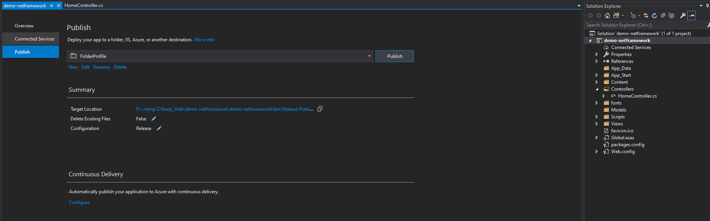
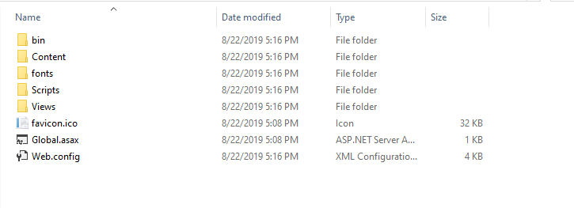
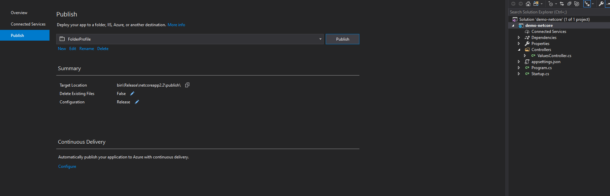
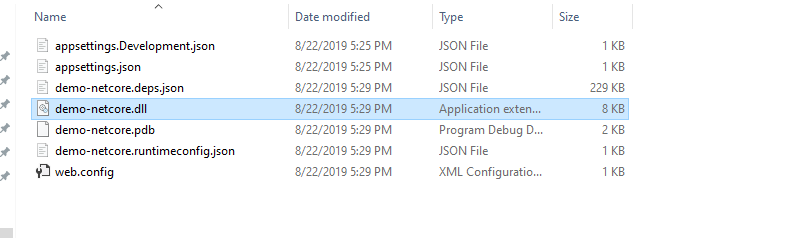
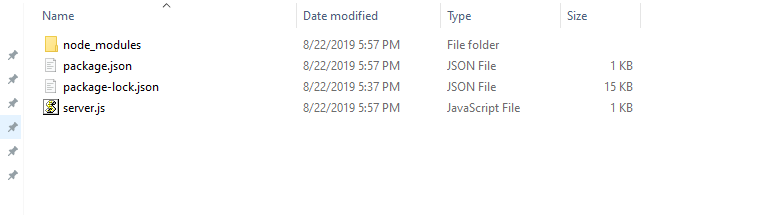

# 如何生成可用的部署文件（zip）

> 所有的部署文件都要打包成 zip 包。

## ASP.NET（Visual Studio 2019）

1. 右键 web 项目 publish 到本地目录。


2. 将所有的部署文件（如 bin\Release\Publish）打包成 zip 文件。（文件名无所谓）


## .NET Core（Visual Studio 2019）

1. 右键 web 启动项目 publish 到本地目录（如 bin\Release\netcoreapp2.2\publish\）。


2. 将所有部署文件打包成 zip 包，记住程序的启动 dll（此处为 demo-netcore.dll）


## NodeJs（express）

1. 准备启动脚本 `server.js` 和 `package.json`

```javascript
// server.js

'use strict';

const express = require('express');

// Constants
const PORT = 80;
const HOST = '0.0.0.0';

// App
const app = express();
app.get('/', (req, res) => {
  res.send('Hello NodeJs\n');
});

app.listen(PORT, HOST);
console.log(`Running on http://${HOST}:${PORT}`);
```

```json
{
  "name": "docker_web_app",
  "version": "1.0.0",
  "description": "Node.js on Docker",
  "author": "hello@example.com",
  "main": "server.js",
  "scripts": {
    "start": "node server.js"
  },
  "dependencies": {
    "express": "^4.16.1"
  }
}
```

2. 将所有文件打包成 zip 包（node_modules 文件夹是不需要包含在其中的）（注意记下此项目的启动命令为 npm start，且对外开放的端口要设置为80）


## PHP
