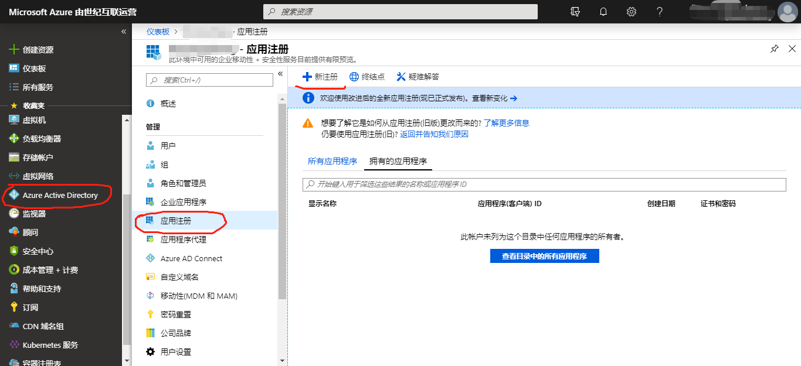
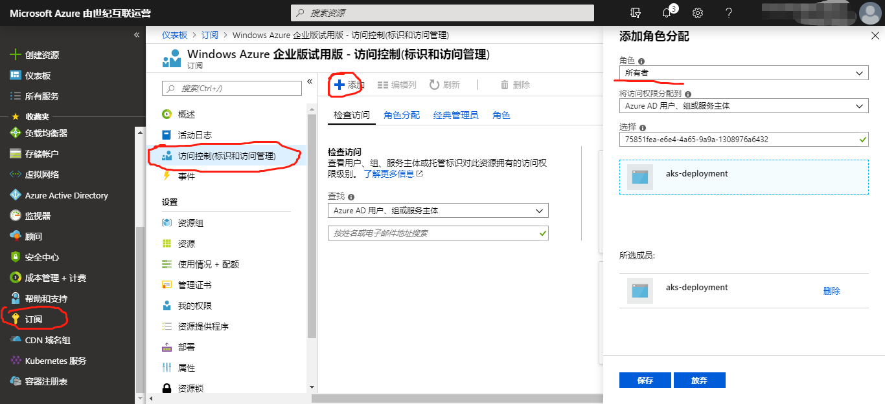

# 如何通过Azure Portal生成并获取服务主体Azure Service Principle信息

> 以下步骤需要您具有订阅的管理员权限。

1. 登录到Azure管理门户，如：[Azure中国](https://portal.azure.cn)。

2. 在左侧导航栏选择Azure Active Directory（如果没有请在All services里面搜索），然后再选择App registrations（应用注册）点击进入，如图。

3. 点击创建（New registration），填写完名字后即可点击完成。

4. 得到并记下App registration的信息。应用程序（客户端）ID，目录（租户） ID均可从详情页面获得。

5. 生成密码。在该页面选择证书和密码，然后点击创建新客户端密码，填写相关信息（说明、有效时限），点击添加。注意，请及时拷贝下生成的密码值，刷新页面后无法再次看到（万一忘记可以重新生成密码）

6. 为生成的App registration赋予订阅的权限。在左侧导航栏选择订阅（Subscription），如果没有请在所有服务中查找。选择目标订阅，点击。然后选择访问控制（标识和访问管理），添加角色分配。填写相关信息（角色：所有者owner，输入之前生成的应用程序ID搜索，点击搜索结果，保存）

7. 最后得到以上步骤中生成的信息：
    - 订阅名称
    - 应用程序(客户端) ID
    - 目录(租户) ID
    - 密码
